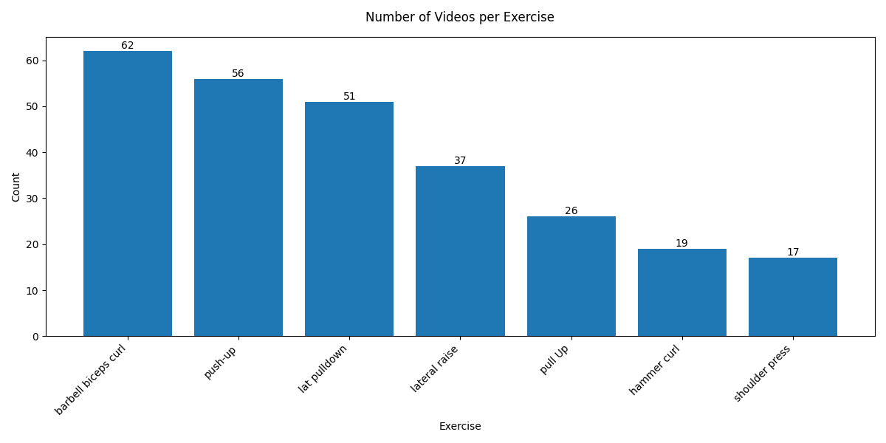
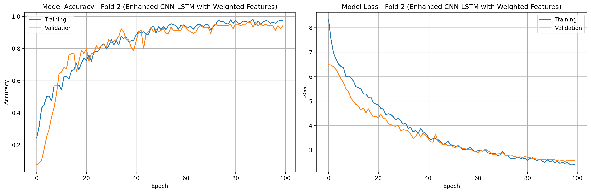
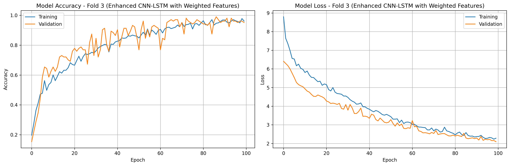
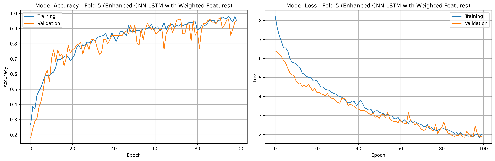
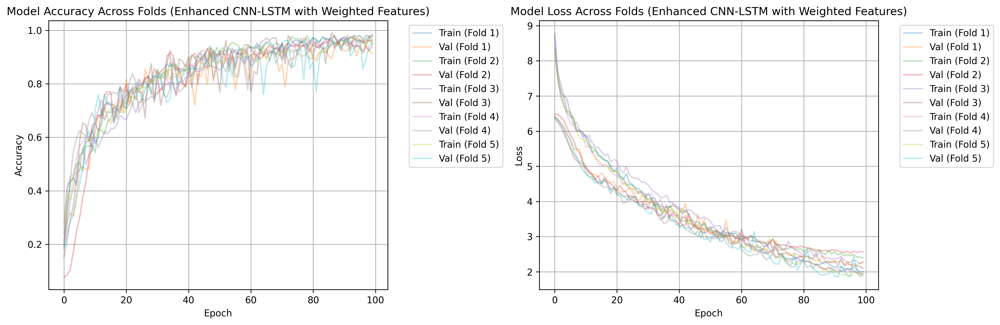
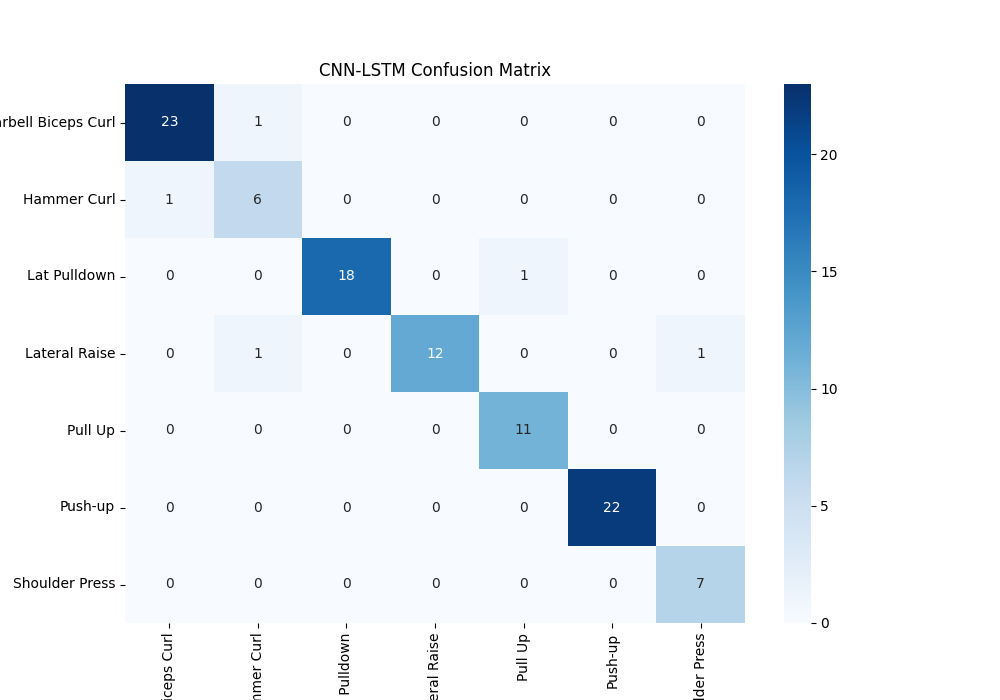

# Workout Video Classifier

This project focuses on classifying workout videos using pose estimation and deep learning techniques. It leverages pose estimation models (e.g., MediaPipe, OpenPose) to extract keypoints from workout videos and uses a hybrid neural network architecture (CNN + LSTM) to classify the type of workout being performed.

---

## Table of Contents
1. [Project Overview](#project-overview)
2. [Repository Structure](#repository-structure)
3. [Setup Instructions](#setup-instructions)
4. [Data Analysis](#data-analysis)
5. [Data Preprocessing](#data-preprocessing)
6. [Training the Model](#training-the-model)
7. [Deployment](#deployment)
8. [Git Best Practices](#git-best-practices)
9. [Contributing](#contributing)
10. [License](#license)

---

## Project Overview
The goal of this project is to classify workout videos into different categories (e.g., push-ups, squats, lunges) using pose estimation and deep learning. The workflow includes:
1. **Pose Estimation**: Extract keypoints (e.g., joints) from workout videos using pose estimation models.
2. **Data Analysis**: Perform exploratory data analysis (EDA) to understand the dataset's characteristics.
3. **Data Preprocessing**: Process the extracted keypoints and prepare them for training.
4. **Model Training**: Train a hybrid neural network (CNN + LSTM) to classify the workout videos.
5. **Deployment**: Deploy the trained model for inference on new videos.

The dataset used for this project is taken from [Kaggle](https://www.kaggle.com/datasets/hasyimabdillah/workoutfitness-video), but only upper body exercises are considered in this implementation.

---

## Repository Structure
```
Workout_Video_Classifier/
├── src/
│   ├── data_analysis/ # Scripts for analyzing the dataset
│   │   └── analyze_dataset.ipynb
│   ├── pre-processing/ # Scripts for video preprocessing
│   │   └── process_videos.ipynb
│   ├── Training/ # Scripts for model training
│   │   └── train_model.ipynb
│   └── u_deploy/ # Scripts for model deployment
│       └── model_deploy.ipynb
├── data/ # Dataset and processed data
├── models/ # Trained models
├── .gitattributes # Git configuration for line endings
├── README.md # Project documentation
└── requirements.txt # Python dependencies
```

---

## Setup Instructions
### Clone the Repository
```bash
git clone https://github.com/UddavRajbhandari/Workout_Video_Classifier.git
cd Workout_Video_Classifier
```

### Set Up a Virtual Environment
```bash
python -m venv venv
source venv/bin/activate  # On Windows: venv\Scripts\activate
```

### Install Dependencies
```bash
pip install -r requirements.txt
```

### Download the Dataset
- The dataset used for this project is taken from [Kaggle](https://www.kaggle.com/datasets/hasyimabdillah/workoutfitness-video), but only upper body exercises are considered.
- Place your workout video dataset in the `Upper_body dataset/` folder.
- Ensure the dataset is organized into subfolders by workout type (e.g., `Upper_body dataset/pushups/`).

---

## Data Analysis
- Use the `analyze_dataset.ipynb` notebook to perform exploratory data analysis (EDA).
- The analysis includes:
  - Distribution of workout categories
  - Statistical summary of keypoints
  - Visualizations of sample keypoints


---

## Data Preprocessing
### Extract Keypoints
- Use the `process_videos.ipynb` notebook to extract pose keypoints from the videos.
- The script uses a pose estimation model (e.g., MediaPipe) to detect and save keypoints.

### Prepare Training Data
- The extracted keypoints are processed and saved in a format suitable for training (e.g., NumPy arrays or TFRecords).

---

## Training the Model

### Train the Hybrid Model:
- The CNN + LSTM model is trained on the extracted keypoints from workout videos.
- We use **k-fold cross-validation (k=5)** to evaluate model performance.
- Each fold is trained separately, and the final performance is averaged.

### Training Curves:
Below are the **training and validation loss curves** for each fold:

#### **Fold-wise Training Loss Curves**






#### **Combined Loss Curve (All Folds)**
To get an overall view of training stability, we plot the average loss across all five folds.



## Model Evaluation

The model's performance is assessed using the following metrics:

- **Accuracy**: The percentage of correctly classified videos.
- **F1-Score**: The harmonic mean of precision and recall, useful for imbalanced datasets.
- **Loss Curves**: Training and validation loss curves to monitor overfitting.

---

## Confusion Matrix

A confusion matrix is used to visualize the model's performance across different workout classes. It shows:

- **True Positives (TP)**: Correctly predicted positive classes.
- **True Negatives (TN)**: Correctly predicted negative classes.
- **False Positives (FP)**: Negative classes incorrectly predicted as positive.
- **False Negatives (FN)**: Positive classes incorrectly predicted as negative.

---


### Interpreting the Confusion Matrix:

- The **rows** represent the actual classes.
- The **columns** represent the predicted classes.
- The **diagonal** (from top-left to bottom-right) shows the number of correct predictions for each class.
- **Off-diagonal** values indicate misclassifications, which can help identify classes that the model struggles to distinguish.


---

## Deployment
### Deploy the Model
- Use the `model_deploy.ipynb` notebook to deploy the trained model for inference.
- The deployed model can classify new workout videos in real-time or batch mode.

---

## Git Best Practices
To ensure consistency across collaborators, follow these Git practices:

### Line Endings
Use LF (Unix) line endings for all files.
Add a `.gitattributes` file to enforce LF line endings:
```plaintext
* text=auto
*.ipynb text eol=lf
*.py text eol=lf
*.md text eol=lf
```

### Branching Strategy
Use feature branches for new developments:
```bash
git checkout -b feature/your-feature-name
```
Merge branches into `main` after code review.

### Commit Messages
Write clear and descriptive commit messages:
```bash
git commit -m "Add pose estimation pipeline for video preprocessing"
```

### Pull Before Push
Always pull the latest changes before pushing your work:
```bash
git pull origin main
git push origin feature/your-feature-name
```

---

## Contributing
We welcome contributions! Please follow these steps:
1. Fork the repository.
2. Create a new branch for your feature or bugfix.
3. Submit a pull request with a detailed description of your changes.

---

## License
This project is licensed under the MIT License. See the LICENSE file for details.
